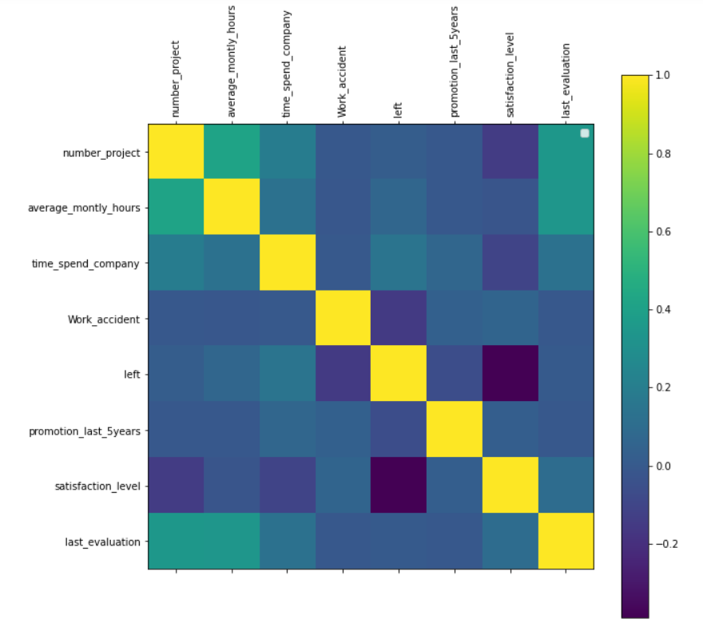
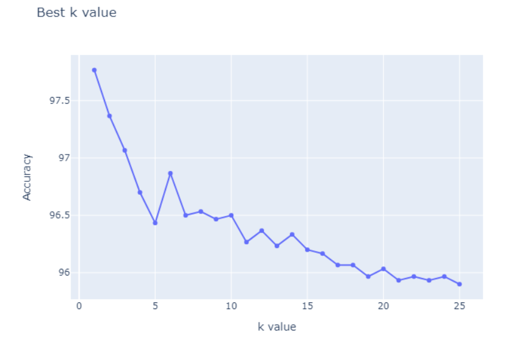
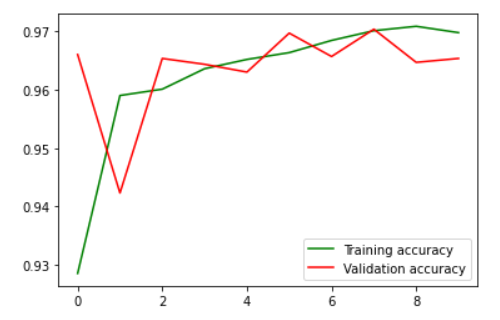
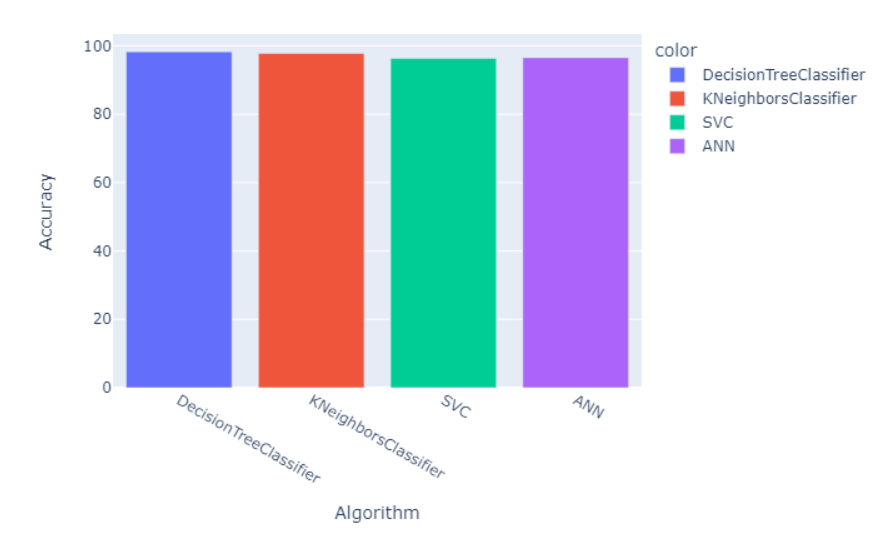
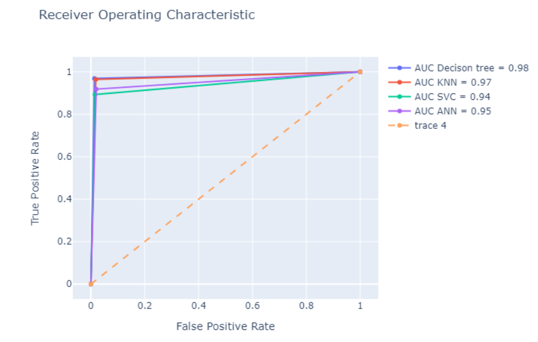

# Employee Churn

This project emphasizes on predicting churn of an employee within an 
organization such that whether the employee will leave the company or 
continue with it. It uses the data of previous employees who have 
worked for the company and by finding a pattern it predicts the churn 
in the form of yes or no.

## 🛠Libraries Required

| Library   | Version  |
| :-------- | :------- |
| `NumPy` | `1.21.5+vanilla` |
| `Pandas` | `1.1.5` |
| `Matplotlib` | `3.5.1` |
| `Seaborn` | `0.11.2` |
| `Scikit-learn` | `1.0.2` |
| `Tensorflow` | `2.8.0` |
| `Chart-Studio` | `1.1.0` |

## 📸Screenshots

* Heatmap/Correlation Matrix

* Best k value(k = 1) for KNN algorithm

* ANN training and validation loss        

* Accuracy graph

https://chart-studio.plotly.com/~Ankit77/4 👈 Interactive plot done in plotly

* ROC curve       

https://chart-studio.plotly.com/~Ankit77/10 👈 Interactive plot done in plotly

### Accuracy

| Model   | Accuracy  |
| :-------- | :------- |
| `Decision Tree` | `98.26` |
| `KNN` | `97.76` |
| `SVC` | `96.33` |
| `ANN` | `96.53` |

## 🔗 Links

You can connect with me here 😀

